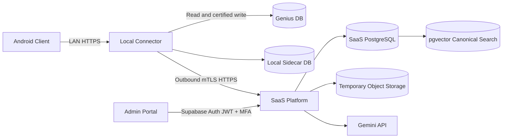

# System Architecture

## 1. Context

المنصة موزعة بين Android،صيدلية محلية وSaaS. الـ Local Connector هو authority لأي قرار يعتمد على Genius DB، بينما SaaS هو authority للـ subscription،quota وOCR orchestration.

## 2. Trust Boundaries

| Boundary | الخطر | التحكم المطلوب |
|---|---|---|
| Android ↔ Connector | جهاز مفقود أوLAN attacker | pairing certificate،short-lived tokens،TLS،device revocation |
| Connector ↔ SaaS | tenant spoofing أوreplay | mTLS،signed request metadata،nonce/idempotency key |
| SaaS ↔ Gemini | secret leakage وunbounded cost | central credentials في KMS،quota reservation،redacted logs |
| Connector ↔ Genius | silent corruption | least privilege،fingerprint،certified adapter،transaction،reconciliation |
| Admin ↔ SaaS | high-impact account takeover | mandatory MFA/AAL2،RBAC،step-up،break-glass audit |

## 3. Android Client

Android مسؤول عن presentation وhuman decisions فقط:

- capture وpage ordering.
- review of OCR evidence.
- local catalog search عبر Connector.
- expiry/batch split editor.
- New Item wizard.
- user confirmation وإظهار final reconciliation status.

لا يحتوي على Gemini SDK أوAPI key؛ أي secret داخل APK قابل للاستخراج. Android project الجديد يتصل بالـ Local Connector فقط.

## 4. Local Connector

يتكون منطقيًا من:

- **Windows Service Host:** durable background execution.
- **Control UI:** visible health،pairing،queue،diagnostics وsupervised recovery.
- **Local API:** Android pairing،upload،review commands وstatus stream.
- **Catalog Projection:** identifiers + raw labels recovered from reversed bytes + explicit name-quality flags.
- **Matching Engine:** deterministic identifiers ثم structured constraints ثم vector shortlist.
- **Job Engine:** state machine وidempotency.
- **File Sandbox:** validation،malware scanning وencrypted TTL storage.
- **Genius Adapter:** كل read/write knowledge الخاصة بالـ legacy schema.
- **Reconciliation Engine:** independent postconditions قدر الإمكان.
- **Sidecar Store:** jobs،mappings،audit،device identities وcommit journal.

Genius Adapter وReconciliation Engine لا يجب أن يشتركا في نفس assumptions غير المثبتة. إذا استخدم كلاهما نفس formula الخاطئة فسيؤكد أحدهما خطأ الآخر.

## 5. SaaS Platform

SaaS modules:

- Identity and Tenant Registry.
- Subscription and Quota.
- Connector Certificate Registry.
- OCR Orchestrator.
- Gemini Gateway.
- Usage Ledger.
- Admin and Support APIs.
- Audit and Security Events.
- Notification and Connector Health.
- Canonical Pharma Catalog and pgvector candidate retrieval.

SaaS لا يخزن full Genius catalog أوcurrent stock. يحتفظ بـ Canonical Pharma Catalog structured،embeddings وanonymized mapping evidence محدود. `pgvector` ينتج general candidates، لكنه لا يصبح source of truth للـ local Item identity ولا يخزن `itm_id` كـ global identity.

### Hybrid Retrieval Boundary

1. OCR description تُطبّع إلى structured Pharma attributes.
2. hard filters تستبعد strength/form/pack/ingredient غير المتوافقة.
3. PostgreSQL full-text/trigram search و`pgvector` ينتجان Canonical candidates.
4. SaaS يعيد candidates مع reason/evidence،لا local IDs.
5. Connector يربط Canonical candidate بـ confirmed local mapping أوLocal Catalog search.
6. المستخدم يؤكد `itm_id` النهائي.

Raw Genius names لا تُرسل كـ verified translations. يمكن استخدامها كـ weak lexical evidence فقط بعد exact identifiers وconfirmed mappings،مع الاحتفاظ بمؤشر integrity يوضح duplicate language fields أوmalformed/truncated content.

هذا يمنع vector similarity من تجاوز Pharma identity constraints ويُبقي Genius identity داخل الصيدلية.

## 6. Admin Portal

- tenant/subscription lifecycle.
- connector/device health.
- quota and cost visibility.
- failed job metadata دون raw content افتراضيًا.
- certificate revocation.
- security incident controls.
- time-bound break-glass session.

## 7. Data Ownership

| البيانات | Source of Truth | Replication policy |
|---|---|---|
| Item/Vendor catalog | Genius DB | Local projection فقط |
| Invoice image | Temporary local/SaaS object | encrypted TTL،لا retention دائم افتراضيًا |
| OCR result | Sidecar | SaaS يحتفظ بنسخة تشغيلية محدودة حسب retention |
| Confirmed mappings | Sidecar | optional anonymized aggregate إلى SaaS |
| Canonical Pharma products/embeddings | SaaS PostgreSQL + pgvector | structured master،ليس نسخة من Genius |
| Subscription/quota | SaaS PostgreSQL | Connector يحصل على signed entitlement cache |
| Commit result | Genius DB + Sidecar journal | SaaS status metadata فقط |
| Audit | Sidecar للعمليات المحلية،SaaS للإدارة/cloud | append-oriented وretention محددة |

## 8. Availability and Offline Model

- Android يحتاج Connector على LAN.
- Connector يستطيع capture وqueue دون Internet.
- لا يبدأ Gemini OCR دون SaaS.
- OCR result الموجود محليًا يمكن مراجعته offline.
- Commit offline مسموح فقط عندما signed entitlement لم ينتهِ وضمن offline allowance.
- انتهاء entitlement لا يلغي invoices committed مسبقًا ولا يحذف local data.

## 9. Scaling Model

- scale unit في SaaS هو tenant/job، وليس pharmacy database connection.
- OCR workers stateless.
- quota reservation في PostgreSQL transaction.
- object storage منفصل عن relational DB.
- connector commits serialized لكل Genius DB.
- لا يوجد Kubernetes في البداية؛ managed containers تكفي حتى تثبت الحاجة التشغيلية الفعلية.
